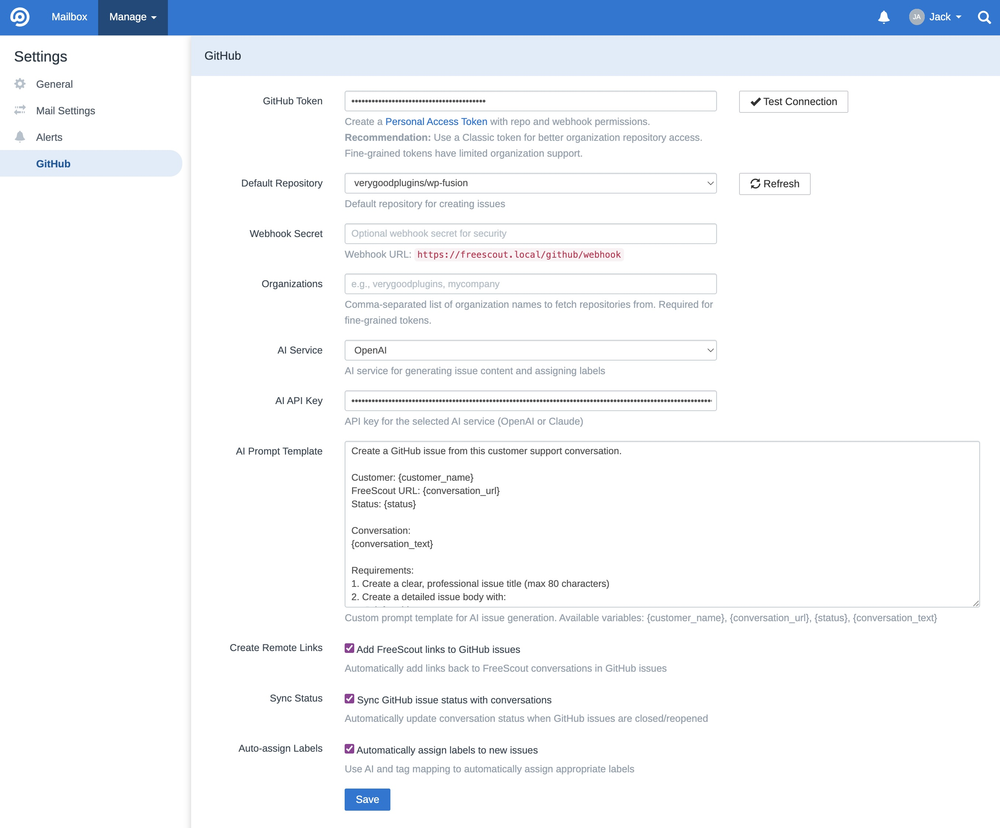
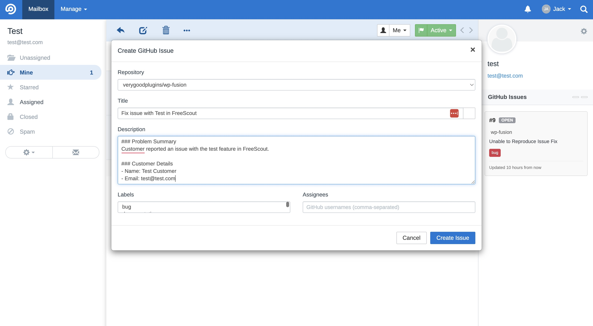
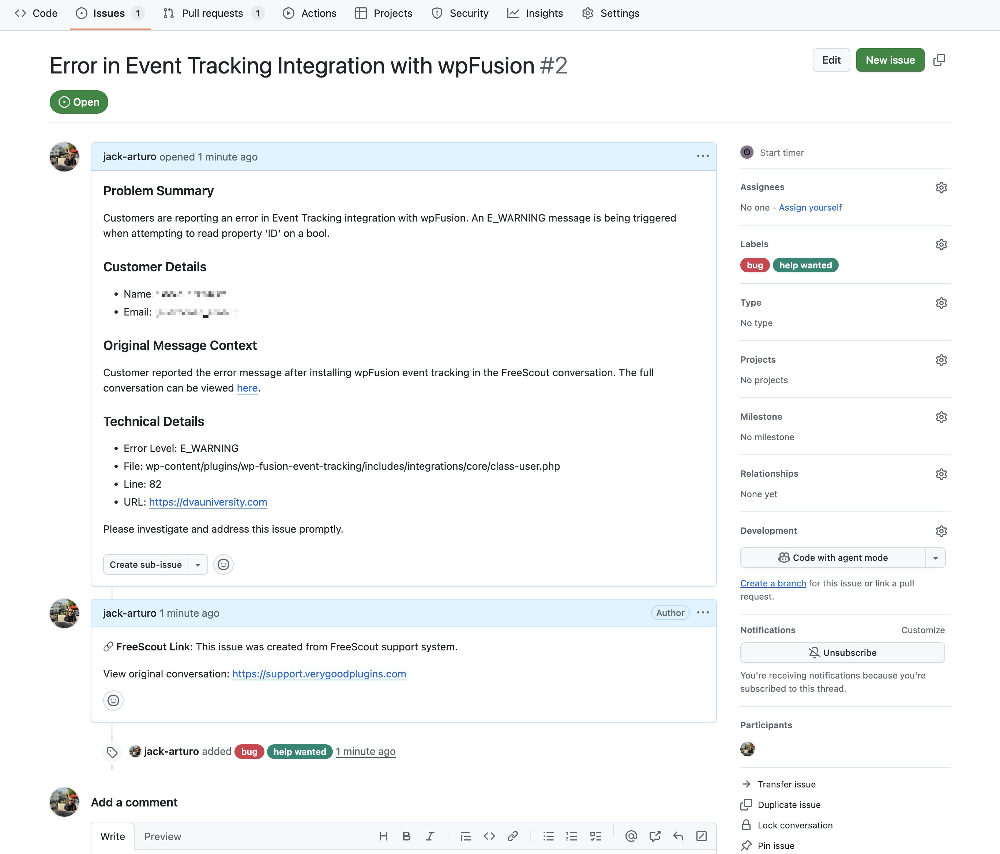
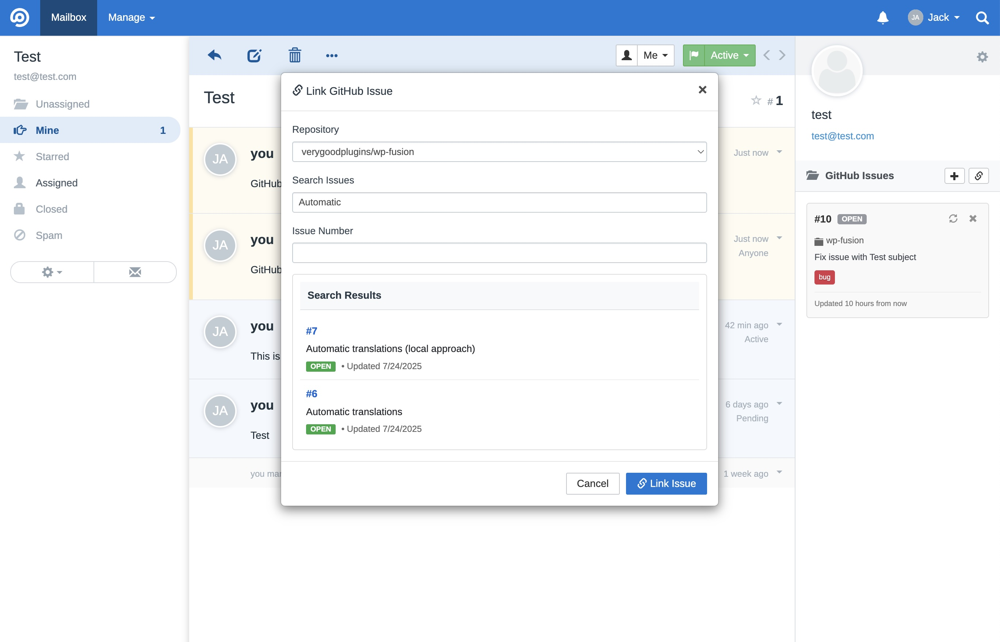

# 🚀 FreeScout GitHub Integration Module

A comprehensive GitHub integration module for FreeScout that enables support teams to seamlessly create, link, and track GitHub issues directly from support conversations. Features AI-powered content generation, intelligent label assignment, and bidirectional synchronization between FreeScout and GitHub.

## ✨ Key Features

| Feature | Description |
|---------|-------------|
| 🤖 **AI-Powered Issue Creation** | Generate issue titles and descriptions automatically using OpenAI or Claude |
| 🔗 **Issue Linking** | Link existing GitHub issues to conversations with intelligent search |
| 🏷️ **AI-Powered Label Assignment** | Automatically populate and suggest GitHub labels in the modal based on conversation context, with configurable eligible labels in settings |
| 📊 **Sidebar Integration** | View and manage GitHub issues directly in the conversation sidebar |
| 🔄 **Bidirectional Sync** | Real-time status updates via GitHub webhooks |
| 🎯 **Multi-Repository Support** | Work with personal, organization, and installation repositories |
| 🛡️ **Environment-Aware SSL** | Automatic SSL configuration for local development environments |

## 📸 Screenshots

| Feature | Screenshot |
|---------|------------|
| **Module Settings** |  |
| **Create GitHub Issue** |  |
| **AI-Generated Issue Content** |  |
| **Link Existing Issue** |  |

## 🏗️ Installation

### Requirements
- FreeScout 1.8.0 or higher
- PHP 7.4 or higher
- GitHub Personal Access Token or GitHub App
- OpenAI or Claude API key (optional, for AI features)

### Installation Steps

1. **Clone the module** into your FreeScout modules directory:
   ```bash
   cd /path/to/freescout/Modules
   git clone https://github.com/your-repo/freescout-github.git Github
   ```

2. **Install dependencies** (if any):
   ```bash
   cd Github
   composer install --no-dev
   ```

3. **Run database migrations**:
   ```bash
   php artisan migrate
   ```

4. **Configure the module** via FreeScout Admin → Settings → GitHub

## ⚙️ Configuration

### GitHub Settings

Navigate to **Admin → Settings → GitHub** to configure:

#### 🔐 GitHub Token
- **Personal Access Token**: Create at https://github.com/settings/tokens
- **Required Scopes**: `repo`, `read:org` (for organization repositories)
- **Fine-grained Tokens**: Supported for enhanced security

#### 📂 Default Repository
- Select from automatically populated dropdown
- Only repositories with issues enabled are shown
- Refresh button to reload available repositories

#### 🌐 Webhook Configuration
- **Webhook URL**: `https://your-freescout-domain.com/github/webhook`
- **Content Type**: `application/json` (required)
- **Secret**: Generate a secure random string (recommended for security)
- **Events**: `issues`

#### 🤖 AI Service Configuration
- **Service**: Choose between OpenAI or Claude
- **API Key**: Enter your OpenAI or Claude API key
- **Custom Prompts**: Configure AI prompt templates

#### 🏷️ Organizations
- Comma-separated list of GitHub organizations
- Used for repository discovery with fine-grained tokens

### Advanced Configuration

#### Custom Issue Templates

Configure custom templates for different scenarios:

**AI Prompt Template**:
```text
Create a GitHub issue from this customer support conversation.

Customer: {customer_name}
FreeScout URL: {conversation_url}
Status: {status}

Conversation:
{conversation_text}

Requirements:
1. Create a clear, professional issue title (max 80 characters)
2. Create a detailed issue body with proper GitHub markdown
3. Include customer context and technical details
4. Maintain professional tone

Respond with valid JSON:
{"title": "Issue title", "body": "Issue body with markdown"}
```

**Manual Template**:
```markdown
## Summary
{conversation_summary}

## Customer Information
- **Name:** {customer_name}
- **Email:** {customer_email}
- **Subject:** {subject}

## Technical Details
{technical_details}

## Original Message
```
{customer_message}
```

## Metadata
- **FreeScout URL:** {conversation_url}
- **Status:** {status}
- **Created:** {created_at}
- **Messages:** {thread_count}
```

## 🚀 Usage

### Creating GitHub Issues

1. **Open a conversation** in FreeScout
2. **Click "Create GitHub Issue"** in the sidebar GitHub Issues section
3. **Review AI-generated content**:
   - Title and description are automatically generated
   - Labels are suggested based on conversation and AI analysis
   - Assignees can be manually selected
4. **Customize if needed** and click "Create Issue"
5. **Issue is created** and automatically linked to the conversation

### Linking Existing Issues

1. **Click "Link GitHub Issue"** in the sidebar
2. **Search for issues** by:
   - Issue number (e.g., "42")
   - Title keywords (e.g., "login problem")
   - Partial matches with intelligent search
3. **Select the issue** from search results
4. **Click "Link Issue"** to create the association

### Managing Linked Issues

- **View issue details** in the conversation sidebar
- **See status indicators** (open/closed, labels, assignees)
- **Click issue links** to open in GitHub
- **Unlink issues** when no longer relevant
- **Automatic status sync** when GitHub issues are closed

## 🔧 Customization

### Label Assignment Rules

The module provides flexible label assignment:

1. **AI Content Analysis**: Analyze conversation content to suggest appropriate labels
2. **Manual Override**: Users can always modify labels before creating issues

### Status Synchronization

Configure automatic status updates:

- **GitHub Issue Closed** → FreeScout Conversation Closed
- **GitHub Issue Reopened** → FreeScout Conversation Active
- **Custom Mappings**: Configure via database or future admin interface

### Webhook Security

Secure your webhook endpoint:

1. **Generate webhook secret** in GitHub repository settings
2. **Configure secret** in FreeScout GitHub module settings
3. **Automatic signature verification** prevents unauthorized requests

## 🔍 Technical Details

### Architecture

```
Github/
├── Config/                 # Module configuration
├── Database/
│   ├── Migrations/        # Database schema
│   └── Seeders/          # Initial data
├── Entities/             # Eloquent models
│   ├── GithubIssue.php
│   └── GithubIssueConversation.php
├── Http/
│   ├── Controllers/      # API endpoints
│   └── routes.php       # Route definitions
├── Providers/           # Service providers
├── Public/             # Assets (CSS/JS)
├── Resources/views/    # Blade templates
├── Services/          # Business logic
│   ├── GithubApiClient.php
│   ├── IssueContentGenerator.php
│   └── LabelAssignmentService.php
└── module.json        # Module metadata
```

### Database Schema

**github_issues**:
```sql
- id (primary key)
- number (GitHub issue number)
- repository (owner/repo format)
- title (cached from GitHub)
- state (open/closed)
- labels (JSON array)
- assignees (JSON array)
- created_at, updated_at
```

**github_issue_conversation**:
```sql
- id (primary key)
- github_issue_id (foreign key)
- conversation_id (foreign key)
- unique constraint on (github_issue_id, conversation_id)
```

**github_label_mappings**:
```sql
- id (primary key)
- freescout_tag (varchar)
- github_label (varchar)
- repository (varchar)
- confidence_threshold (decimal)
- created_at, updated_at
```

### API Integration

The module integrates with multiple GitHub API endpoints:

- **Issues API**: Create, update, search issues
- **Search API**: Advanced issue search with multiple strategies
- **Repositories API**: Discover user and organization repositories
- **Labels API**: Fetch repository labels for assignment
- **Webhooks API**: Receive real-time updates

### Environment-Aware SSL Configuration

The module automatically handles SSL certificate verification:

```php
// Automatic detection of local development environments
$isLocalDev = in_array(config('app.env'), ['local', 'dev', 'development']) || 
              strpos(config('app.url'), '.local') !== false ||
              strpos(config('app.url'), 'localhost') !== false;

// SSL settings adapt to environment
CURLOPT_SSL_VERIFYPEER => !$isLocalDev,
CURLOPT_SSL_VERIFYHOST => $isLocalDev ? 0 : 2,
```

## 🐛 Troubleshooting

### Common Issues

**Repository Loading Issues**:
- Verify GitHub token has `repo` and `read:org` scopes
- Check SSL configuration for local development
- Review logs at `storage/logs/laravel.log`

**AI Content Generation Failures**:
- Verify API key is correctly configured
- Check AI service is selected (OpenAI/Claude)
- Review conversation content for API token limits

**Webhook Not Working**:
- Verify webhook URL is publicly accessible
- Check webhook secret matches configuration
- Review GitHub webhook delivery logs

**SSL Certificate Errors** (Local Development):
- Module automatically disables SSL verification for `.local` and `localhost` domains
- For other local setups, add domain detection in `GithubApiClient.php`

### Debug Mode

Enable debug logging by adding to your `.env`:
```env
LOG_LEVEL=debug
```

Check logs in `storage/logs/laravel.log` for detailed API interactions.

### Performance Optimization

- **Repository Caching**: Repositories are cached for faster loading
- **Issue Data Sync**: Only essential issue data is cached locally
- **Rate Limit Handling**: Automatic rate limit detection and retry logic
- **Webhook Processing**: Asynchronous webhook processing prevents timeouts

## 🔒 Security Features

- **Token Encryption**: GitHub tokens are stored securely in FreeScout's options system
- **Webhook Signature Verification**: All webhook requests are cryptographically verified
- **Input Sanitization**: All user inputs are sanitized before API calls
- **SSL Certificate Verification**: Enabled by default in production environments
- **Rate Limit Compliance**: Automatic rate limit handling prevents API abuse

## 🚀 Performance

- **Lazy Loading**: Issue data is loaded on-demand in the conversation sidebar
- **Intelligent Search**: Multiple search strategies ensure relevant results
- **Minimal API Calls**: Smart caching reduces unnecessary GitHub API requests
- **Async Processing**: Webhook events are processed asynchronously

## 🆘 Support

For issues, feature requests, or contributions:

1. **Check existing issues**: Review GitHub issues for similar problems
2. **Create detailed bug reports**: Include FreeScout version, PHP version, and error logs
3. **Feature requests**: Describe use case and expected behavior
4. **Pull requests**: Follow coding standards and include tests

## 📄 License

This module is released under the same license as FreeScout. See the FreeScout license for details.

## 🙏 Acknowledgments

- **FreeScout Team**: For the excellent help desk platform
- **GitHub API**: For comprehensive API access
- **OpenAI/Anthropic**: For AI-powered content generation
- **Community Contributors**: For feedback and improvements

---

## 📋 Changelog

### v1.1.0 (August 13 2025)
- **Added**: GPT-4o-mini and GPT-5-mini model support with model selection in settings
- **Added**: Automatic label assignment in modal based on LLM suggestions from the conversation
- **Added**: Multi-select label interface for better label management during issue creation
- **Added**: Color-coded GitHub labels in modal for improved visual organization
- **Enhanced**: AI prompt engineering with improved context and formatting for better issue generation
- **Enhanced**: Label assignment service with intelligent limiting and reduced API calls
- **Enhanced**: Error handling throughout the application with better user feedback
- **Improved**: Performance optimizations with reduced GitHub API calls
- **Improved**: UI/UX with better modal styling and label visualization

### v1.0.2 (July 31 2025)
- **Enhanced**: Refresh functionality now fetches fresh data from GitHub API with intelligent caching
- **Enhanced**: Improved support for HTML tables in tickets (i.e. from a Gravity Forms submission)
- **Enhanced**: Added support for `{customer_email}` placeholder in AI-generated issue content
- **Fixed**: GitHub webhook 404 errors by removing CSRF middleware from webhook route
- **Fixed**: Conversation status sync behavior - removed automatic sync between closing tickets and GitHub issues

### v1.0.1 (July 25 2025)
- **Fixed**: Modal z-index issues in production environments
- **Improved**: Environment-aware SSL certificate verification
- **Enhanced**: Modal positioning with automatic body placement
- **Added**: Comprehensive README documentation with screenshots

### v1.0.0 (July 25 2025)
- **Initial Release**: Full GitHub integration with AI-powered content generation
- **Features**: Issue creation, linking, search, and bidirectional sync
- **Support**: Multi-repository access with intelligent caching
- **AI Integration**: OpenAI and Claude support for automated content generation

---

## 👨‍💻 Credits

**Developed by**: [Jack Arturo](https://x.com/verygoodplugins/) from [Very Good Plugins](https://drunk.support/)

Special thanks to the FreeScout community and the contributors who helped test and improve this integration.

---

**Version**: 1.1.0  
**Compatibility**: FreeScout 1.8.0+  
**Last Updated**: August 13 2025